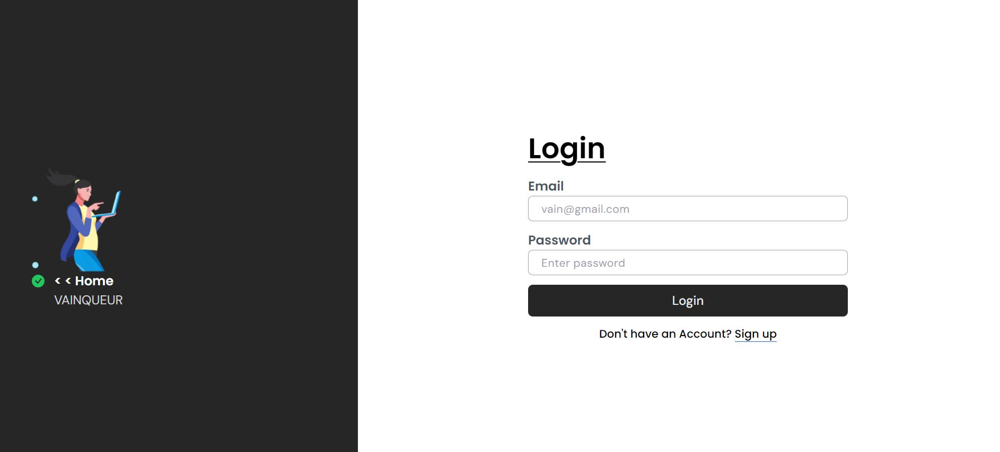

## Login | Sign Up | User Management React App

This is a react application that allows users to create and manage accounts.



### It Have Two Users:

- Normal User
- Admin

### A User is able to :

- Create an Account
- Login into The Account

### An Admin Is Able To :

- See all the users
- Delete a User
- Edit a user

## To get Started As A User

To login as a user you have to Click on the dropdown arrow at the top and choose SignUp
after Signing Up You will be redirected on the Login Page Where You will Put the Credentials you just used Signing Up

## To get Started As An Admin :

To Login As An admin You will Have to Use These Credentials :

- Email

  ```sh
  klabadmin@gmail.com
  ```

- Password
  ```sh
  password
  ```

### It is Built with


### Other Features

- You can see the Name Of a person Who is logged In
- it has the loading Features
- Pagination When Displaying all users

- This is The Backend API I have Used To integrate those Functions <a href="https://holiday-planner-4lnj.onrender.com/api-docs/#/" target="blank">https://holiday-planner-4lnj.onrender.com/api-docs/#/</a>

### Live(Deployed) Version

- <a href="https://react-js-auth-aut.vercel.app/" target="blank">https://react-js-auth-aut.vercel.app/</a>
